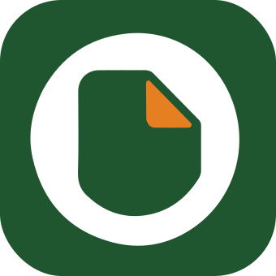

<p align="center"></p>
<h1 align="center">igo — Internal Government Operation</h1>
<p align="center"><em>Ruang kerja PDF internal, privacy-first, untuk lingkungan BPDP.</em></p>

<p align="center">
  
  
  
</p>

---

**igo** (Internal Government Operation) adalah aplikasi PDF tools internal kantor. Sebagian besar pemrosesan dokumen berjalan **langsung di browser (client-side)**, sehingga file kerja tetap berada di perangkat pengguna. Akses aplikasi dikelola sepenuhnya lewat akun internal — tidak ada registrasi publik.

> Aplikasi ini bersifat **internal** dan tidak dipublikasikan secara terbuka.

## Fitur

- **100+ alat PDF** — merge, split, compress, convert (dari/ke gambar & Office), edit, rotate, crop, watermark, page numbers, OCR, sign, form filler/creator, sanitize, dan lainnya.
- **Privacy-first** — mayoritas alat memproses dokumen di browser; file tidak dikirim ke server.
- **Autentikasi internal** — login session-cookie + CAPTCHA + RBAC (admin/user), dengan **SSO Active Directory (LDAP)** dan auto-provision untuk user AD.
- **Light / Dark mode** — tema terang & gelap yang bisa di-toggle, dengan aksen oranye (Vibrant Palm) dan hijau (Deep Forest).
- **PWA** — bisa dipasang sebagai aplikasi dan berjalan offline.
- **Bilingual** — Bahasa Indonesia & English (in-place, tanpa reload).

## Teknologi

| Lapisan | Stack |
|---|---|
| Frontend | Vite (multi-page), TypeScript, Tailwind CSS v4, Public Sans |
| Backend | Node.js + Express, PostgreSQL (`pg`), argon2, `ldapjs` |
| Deploy | Docker (image `igov2-frontend` / `igov2-backend`), nginx |

## Menjalankan secara lokal

**Frontend**

```bash
npm install
npm run dev      # Vite dev server
npm run build    # build produksi ke dist/
```

**Backend** (`backend/`)

```bash
cd backend
npm install
npm run migrate  # buat skema database
npm run seed     # buat akun admin awal
npm run dev
```

**Docker (full stack)** — lihat `deploy/` (`docker-compose.prod.yml` + `deploy.sh`). Migrasi dijalankan lewat `node dist/scripts/migrate.js`; seed admin dengan `./deploy.sh --seed-admin`.

## Model autentikasi

- **Akun lokal** (mis. `admin` hasil seed) diverifikasi terhadap `password_hash` argon2 tersimpan, dikelola lewat panel admin.
- **User AD/LDAP** login dengan kredensial Active Directory (pola *search-then-bind*); pada login pertama, akun otomatis dibuat (`auth_source='ldap'`). Password tidak pernah disimpan — diverifikasi live ke direktori setiap login.
- Admin **selalu** akun lokal; panel admin hanya menampilkan/mengelola user lokal.

Konfigurasi (database, session, LDAP/LDAPS) diatur lewat environment variables — lihat `deploy/.env.prod.example`.

## Lisensi

Didistribusikan dengan **AGPL-3.0-only**. igo menggunakan **BentoPDF** sebagai basis/engine pemrosesan PDF — penyebutan ini dipertahankan untuk atribusi lisensi, bukan sebagai branding produk. Komponen pihak ketiga (PDF.js, pdf-lib, Tesseract, PyMuPDF, Ghostscript, CoherentPDF, Lucide, Phosphor, dll.) mengikuti lisensi masing-masing.
